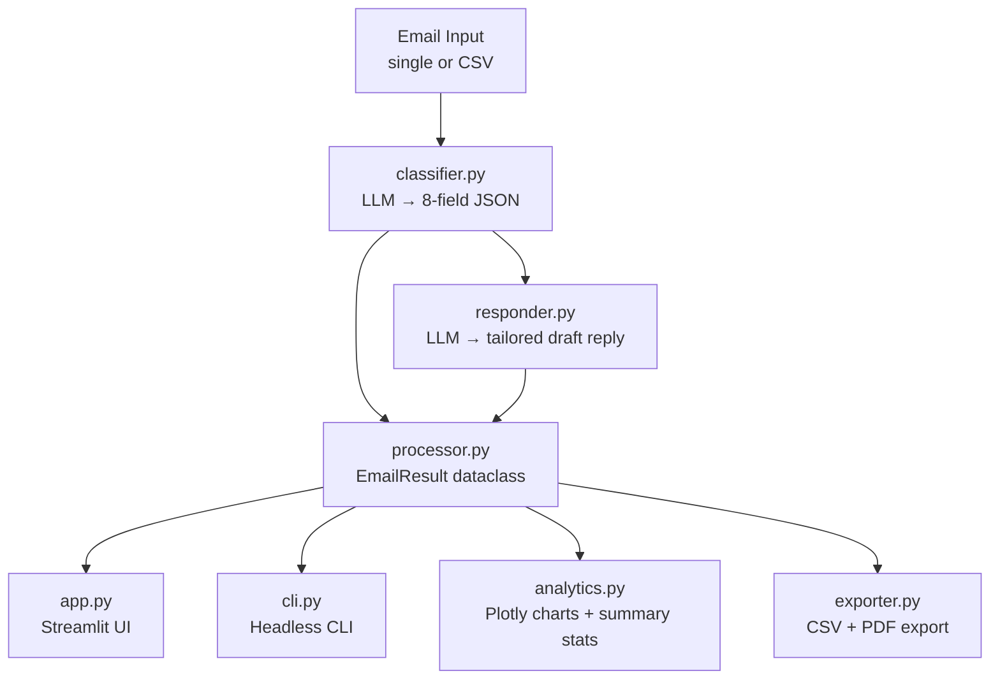

# AI Email Classifier & Auto-Responder

> Classifies customer emails by intent, urgency, and churn risk. Auto-drafts tailored, multilingual replies. Batch-processes entire CSVs. Full Plotly analytics dashboard. Runs 100% locally on CPU — no data sent to any cloud service.


---

## Business Use Case

Support teams waste hours triaging tickets. This tool reads every email, classifies it in seconds, flags churn risks before they escalate, and drafts a human-quality reply — ready to send with one click.

| Without this tool | With this tool |
|---|---|
| Hours of manual ticket triage | < 3 seconds per email |
| Missed churn signals | Churn probability scored 0–100% |
| Generic copy-paste replies | Tailored, empathetic drafts |
| Data sent to OpenAI / cloud | 100% local — GDPR compliant |

---

## Features

| Feature | Details |
|---|---|
| 8-category classification | billing, bug_report, feature_request, churn_risk, complaint, general_inquiry, praise, refund_request |
| 4-level urgency | low / medium / high / critical |
| 5-level sentiment | very_positive → very_negative |
| Churn probability | 0.0–1.0 score with configurable alert threshold |
| Auto-drafted replies | Tailored to category, urgency, and sentiment |
| Multilingual | Auto-detects language; replies in detected or chosen language |
| Batch CSV | Upload 1000 emails, get a classified CSV back with progress bar |
| Analytics dashboard | Category pie, urgency heatmap, churn scatter, sentiment bar |
| PDF analytics export | Management-ready one-click report |
| CLI support | Run headless via `python cli.py` |
| Unit tested | pytest suite for all pure-logic modules |
| Docker-ready | One command: `docker-compose up` |

---

## Architecture



**Clean module separation:**

```
classifier.py          — LLM classification prompt + JSON parsing
responder.py           — Draft reply generation
processor.py           — Orchestrates classifier + responder; single + batch API
analytics.py           — Summary stats + 4 Plotly chart builders
exporter.py            — CSV bytes + PDF analytics report
app.py                 — Streamlit UI (imports all modules above)
cli.py                 — Headless CLI runner
generate_sample_data.py — Creates 20-row demo CSV
tests/
  test_classifier.py   — Unit tests: JSON parsing, validation, field logic
  test_analytics.py    — Unit tests: summary stats, chart data, churn filter
```

---

## Quick Start

### Option A — Streamlit UI (recommended)

```bash
# 1. Install Ollama: https://ollama.ai
ollama pull llama3

# 2. Clone and install
git clone https://github.com/adamhakeem17/email_classifier
cd ai-email-classifier
pip install -r requirements.txt

# 3. Generate a demo dataset
python generate_sample_data.py

# 4. Run
streamlit run app.py
```
Open [http://localhost:8501](http://localhost:8501)

---

### Option B — CLI

```bash
# Classify a single email
python cli.py --text "I was charged twice this month and nobody is responding!"

# Batch process a CSV (must have 'email' column)
python cli.py --csv sample_data/demo_emails.csv --output results.csv

# With PDF analytics report
python cli.py --csv sample_data/demo_emails.csv --pdf-report

# Output raw JSON (useful for piping to other tools)
python cli.py --text "Cancel my subscription please" --json
```

---

### Option C — Docker

```bash
git clone https://github.com/adamhakeem17/email.classifier
cd ai-email-classifier
cp .env.example .env
docker-compose up --build
```

---

## Running Tests

```bash
pip install pytest
pytest tests/ -v
```

Tests cover:
- JSON parsing from LLM output (clean, with preamble, with markdown fences, invalid)
- Field validation and fallback logic
- `needs_human_review` computed property across all trigger conditions
- Analytics summary stats (total, churn, review counts, averages)
- High churn table filtering and sort order

---

## Classification Output Schema

```json
{
  "category":           "billing",
  "urgency":            "high",
  "sentiment":          "negative",
  "churn_probability":  0.72,
  "confidence":         0.91,
  "language":           "English",
  "key_issue":          "Customer charged twice this month",
  "customer_tone":      "frustrated",
  "needs_human_review": true,
  "draft_reply":        "I'm sorry to hear about the double charge...",
  "processing_ms":      1243
}
```

---

## Test Datasets

| Dataset | Source | Size |
|---|---|---|
| Demo CSV (included) | `generate_sample_data.py` | 20 rows |
| Bitext Customer Support | [HuggingFace](https://huggingface.co/datasets/bitext/Bitext-customer-support-llm-chatbot-training-dataset) | 27k rows |
| Enron Email Corpus | [Kaggle](https://www.kaggle.com/datasets/wcukierski/enron-email-dataset) | 500k rows |

---

## Configuration

All settings configurable via Streamlit sidebar or CLI flags:

| Setting | Default | Description |
|---|---|---|
| Ollama Model | `llama3` | Any locally installed Ollama model |
| Company Name | `Acme Corp` | Used in reply sign-off |
| Agent Name | `Support Team` | Used in reply sign-off |
| Reply Language | `auto` | Auto-detect or force a language |
| Max Reply Words | `150` | Controls draft reply length |

---

## Project Structure

```
ai-email-classifier/
├── app.py                    # Streamlit UI (imports all modules)
├── cli.py                    # Headless CLI runner
├── classifier.py             # LLM classification logic
├── responder.py              # Draft reply generation
├── processor.py              # Orchestrator: single + batch + DataFrame API
├── analytics.py              # Plotly charts + summary statistics
├── exporter.py               # CSV + PDF export
├── generate_sample_data.py   # Creates 20-row demo CSV
├── requirements.txt
├── Dockerfile
├── docker-compose.yml
├── .env.example
├── .gitignore
├── tests/
│   ├── __init__.py
│   ├── test_classifier.py    # Unit tests: parsing, validation, field logic
│   └── test_analytics.py    # Unit tests: stats, charts, filtering
└── README.md
```

---

## Roadmap

- [ ] Gmail API integration — classify inbox automatically
- [ ] Zapier / Make.com webhook on new email trigger
- [ ] HubSpot / Salesforce CRM webhook for churn risk alerts
- [ ] Confusion matrix using a labelled test set
- [ ] Fine-tuned classification model for domain-specific categories

---

## Skills Demonstrated

| Skill | How |
|---|---|
| Prompt engineering | Structured 8-field JSON output; multi-step classification → reply chain |
| Software architecture | Clean module separation: classifier / responder / processor / analytics / exporter |
| LLM chaining | Two-step LangChain pipeline with separate prompts |
| Data visualisation | 4 Plotly charts (pie, stacked bar, scatter, horizontal bar) |
| Unit testing | pytest suite covering all pure-logic modules without LLM calls |
| CLI tooling | argparse with single + batch modes, JSON output flag |
| Production readiness | Docker, env vars, error handling, session state, computed properties |

---

## License

MIT — free to use, fork, and build on.

---

*Built with [LangChain](https://langchain.com) · [Ollama](https://ollama.ai) · [Streamlit](https://streamlit.io) · [Plotly](https://plotly.com)*
# email_classifier
